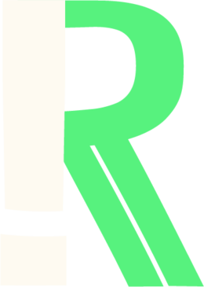

# Socket FreeWaves




#Primera conexión 
###### Recibe  un evento de conexión y el primer evento actualizado
```javascript
socket.on("connect", () => {
  console.log("conected");

  socket.on("server:STORE", (data) => {
    console.log("Store actual:", data); 
  });
```

#Emitir Evento
##### Para emitir el evento al Web Socket usamos el nombre del evento "cliente:EVENTO"(todo lo que empiece por cliente: es del lado del cliente). El cual recibe un objeto con la forma como se muestra.
```javascript
	socket.emit("cliente:EVENTO", {
    name: "Risa", //Nombre el evento
    image: "https://risa.jpg.com", //Url de la imagen
    message: "Mensaje", //String
    type: "Reacción 1", //Tipo de evento
  });
```

#Escucha de Evento
##### Para emitir el evento al Web Socket usamos el nombre del evento "server:EVENTO".  El cual recibe el objeto procesado por el lado del servidor del Web Socket 
```javascript
  socket.on("server:EVENTO", (data) => {
  // Por comodidad pueden descontracturar 
    const { dataEvento, dataEventoProcesado } = data;
  console.log(dataEvento);
  console.log(dataEventoProcesado);
  });
```
###### Devolvería el evento procesado: 
```javascript
{  
	count: 1 //Contador de eventos del mismo tipo
	image: "https://risa.jpg.com", 
    message: "Mensaje", 
	name: "Risa"
	timestamp: "2022-12-15T13:16:51."//Marca de tiempo del ultimo evento del mismo tipo
    type: "Reacción 1", 
}
```
#####Pagina del desarrollador

¡Hola! Mi nombre es Ramiro Gumma y soy Frontend Developer. Para contactarse con migo pude ingresar a mi portafolio web:
https://portafolio-nextjs-omega.vercel.app/
Gracias por su atención.

###Links personales

`<link>` <https://www.linkedin.com/in/ramiro-gabriel-gumma-400993240/>
`<link>` <https://www.workana.com/freelancer/b85e703950de6afa717ace9a8327c73a>